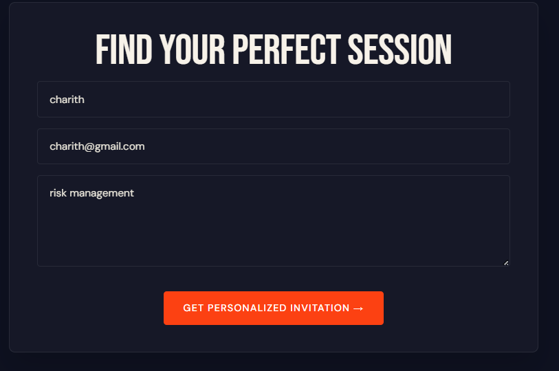
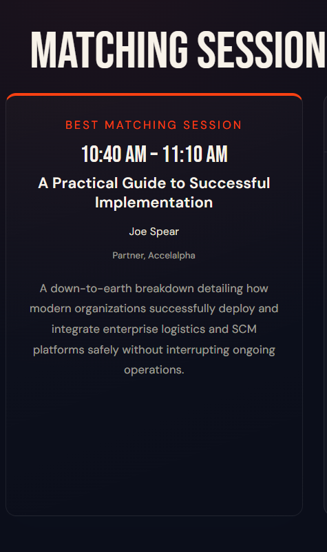

# AccelAlpha Oracle — Event Matching & AI Invitation System

## Project Overview

The **AccelAlpha Oracle Event Matching & AI Invitation System** is a full-stack web application designed to enhance attendee engagement at corporate conferences. The platform analyzes a visitor's professional focus, matches them with the most relevant conference session from the official event agenda, and generates a personalized invitation email using a Large Language Model (LLM).

The solution combines intelligent session matching, AI-powered content generation, and an automated MCP simulation workflow .

---

## Live Gateways

| Layer | URL |
|---|---|
| **Frontend** | https://accelalpha-oracle.vercel.app/ |
| **Backend** | https://accelalpha-oracle.onrender.com |

---

## Repository

**GitHub:** https://github.com/Nuwan-droid/accelalpha-oracle.git

---

## Technology Stack

### Frontend

- React.js
- Vite
- CSS3
- Fetch API

### Backend

- Python
- FastAPI
- Uvicorn
- OpenRouter API

---

## Local Setup Guide

### 1. Clone Repository

```bash
git clone https://github.com/Nuwan-droid/accelalpha-oracle.git
cd accelalpha-oracle
```

---

### 2. Frontend Setup

Navigate to the frontend directory:

```bash
cd frontend
```

Install dependencies:

```bash
npm install
```

Run development server:

```bash
npm run dev
```

---

### 3. Backend Setup

```bash
cd backend
```

Create virtual environment:

```bash
python -m venv venv
```

Activate virtual environment:

**Windows**

```bash
venv\Scripts\activate
```

Install dependencies:

```bash
pip install -r requirements.txt
```

Run FastAPI server:

```bash
uvicorn main:app --reload
```

---

## Environment Variables

Create a `.env` file inside the `backend` directory:

```env
OPENROUTER_API_KEY=api_key
```

---

 
## Content Creation Check
 
### LinkedIn Promotional Post
 
> Corporate events generate the greatest value when every attendee is connected with the sessions most relevant to their professional goals. Our AI-powered Event Matching & Invitation System automatically analyzes attendee interests, recommends the best-fit conference sessions, and generates personalized invitation emails in seconds.
 
| | |
|---|---|
|  |  |

---

## Prompt Strategy

The prompt explicitly instructs the model to:

- Use only the provided session data.
- Prohibit inventing speakers, session titles, times, topics, credentials, or additional agenda items.
- Require omission of any missing information rather than fabrication.
